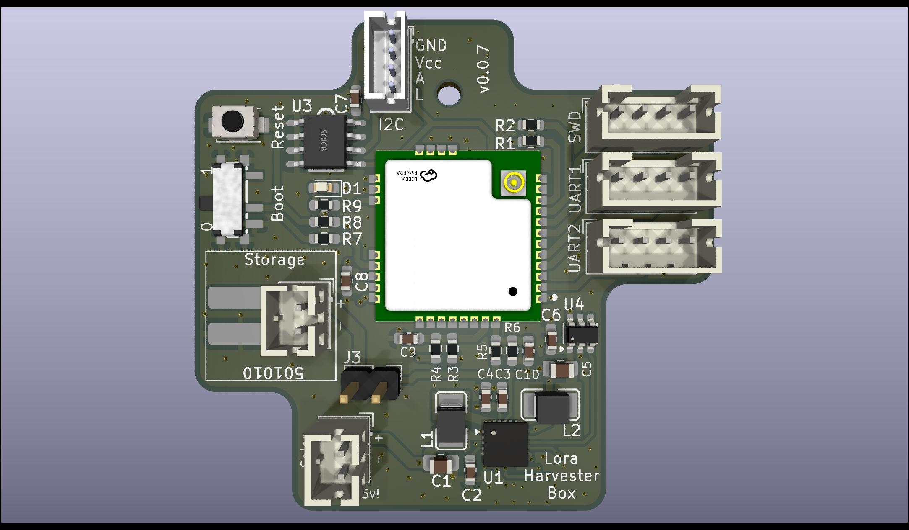

## What is this thing?

This generic LoRa base board is built around the ST STM32WLE5CC (RAK3172) and the TI BQ25570 energy harvester.

It is suitable for a wide range of applications, including:

- Meshtastic (router, sensor) or Meshcore
- LoRaWAN sensors
- Generic raw LoRa devices
- Or virtually any other custom project (ham balloon? Transmitter for tracking penguins?) that utilizes the modulation schemes (FSK, GFSK, MSK, GMSK) of the SX1262

For persistent data storage, an optional FRAM IC (Infineon FM24V10) can be added using I²C. A variety of sensors can additonaly integrated through I²C, SPI (on the back), or USART interfaces.

The power supply design is highly flexible: alongside standard JST-PH connectors, the board also supports very small LiPo batteries (commonly used in in-ear headphones or Bluetooth headsets), which can be soldered directly. Such batteries are readily available on AliExpress (e.g. 501010). The TI BQ25570 also supports exotic storages like Supercaps, LTO, etc.

## Features

### Energy

- Capable of handling a huge variety of energy storages: LiPo, LiFePo4, LTO, SIB, Supercap
- Starts boosting at 600mV. Maximum input voltage is 5.5V. 
- Up to 110mA can be used from the application
- MPPT
- Optional load-switch to switch on/off the entire STM32/LoRa-modem based on the VBAT_OK signal

### Microcontroller

Uses the standardized RAK housing which can house a variety of platforms (ESP32, STM32, etc.) with compatible pins. This variant uses the RAK3172  (ST STM32WLE5CC: 256Kb Flash, 64Kb RAM, 48MHz).

Exposed interfaces:

- 2x USART
- 1x I2C
- 1x SPI (back)
- 2x ADC connected to energy source (like solar) and and energy storage (like LiPos) using voltage dividers
- Multiple break-out pins for GPIOs on the back

### LoRa

Uses the Semtech SX1262 integrated within the STM32 housing. Multiple RAK variants available for 433/470/868/915MHz.

### Data Storage

Infineon FM24V10: 1-MBit non-volatile F-RAM for storing firmware updates, messages or mesurement data

## Design Decisions

### Why did you use the TI BQ25570?

It's the only energy harvester that supports up to 110mA peak current.

I'm not overly happy with this IC as it lacks a few useful features:

 - No I²C interface and ADC for reading voltages/currents

 - No Thermistor for switching off charging above and below specific temperatures

 - Doesn't switch off VOUT if the battery hits the lower threshold. It only signals it using a pin.

 - Rather annoying pin configuration. Layouting it doesn't make much fun.

 - It doesn't have interal high-precision resistors for configuring the voltage limits (VBAT_OV, etc.). Even with 1% tolerance resistors the resulting voltage ranges are barely acceptable due to error propagation.

Honestly - It's an old thing compared to the latest generation from ST or e-peas.
  
### Why not buying a "naked" ST STM32WLE5? 

Using a SoC module from RAK brings all the HF and impedancy matching. 

Everything else leaving the housing is not really critical signal wise.

Also it's not too expensive with 6€.

## Hardware

### Pin Configuration

#### ADC

| Signal | Pin | ADC Channel | Info | 
|:--------:|:----:|:-------------:|:------:|
| Energy Storage Voltage | PB3 | A0 | Voltage goes through a Voltage Divider |
| Energy Source Voltage  | PB4 | A1 | Voltage goes through a Voltage Divider |

#### USART

| Peripheral | TX Pin | RX Pin |
|:------------|:--------|:--------|
| UART1 | PB6 | PB7 |
| UART2 | PA2 | PA3 |

#### SWD

| Signal | Pin |
|:--------|:----|
| SWDIO | PA13 |
| SWCLK | PA14 |

##### SPI

| Signal | Pin |
|:--------|:----|
| SPI1, MOSI | PA7 |
| SPI1, MISO | PA6 |
| SPI1, CLK  | PA5 |
| SPI1, NSS  | PA4 |

#### LED

| Signal | Pin |
|:--------|:----|
| LED | PA8 |

#### MISC

| Signal | Pin |
|:--------|:----|
| VBAT_OK from TI BQ25570| PA15 |

### Resistors Values

**Warning:** 

You have to be super careful here. Don't trust your 1%-SMD-Resistor book from Aliexpress or Amazon. Measure each resistor with a high-resolution multimeter and then calculate the voltages according to the readings! A shabby Libreoffice Calc sheet can be found within the `docs` folder to do this.

I wrote a script for calculating proper resistor values here: [ti-bq25570-calculator](https://github.com/h0lad/ti-bq25570-calculator).

## Hardware Verification

### PCB Version v0.0.5

**Power Chain**

✅ 3.3V from TI BQ25570

✅ Charges power storage as defined with R_OV1 and R_OV2

✅ VBAT_OK signal with 3.3V LiPo attached as a storage

✅ Boosts 0.6V to 3.3V without energy storage attached

✅ Lower and upper  VBAT_OK threshold: not testable at the moment. 

✅ Power switch (TI TPS22917DBV) - seems to work. But blocked to to point above.

Findings:
 - The BQ25570 doesn't like my extremely noisy power supply as a storage emulation. It doesn't come up.
 - You have to be very careful as even the tolerance of 1% resistors (R_OV1 and R_OV2) might cause overcharging. So stay away from the hard limits of your battery.

**ST STM32WL55**

✅ Connect to the SWD interface using a ST-Link

## License

CERN Open Hardware Licence Version 2 - Strongly Reciprocal 

